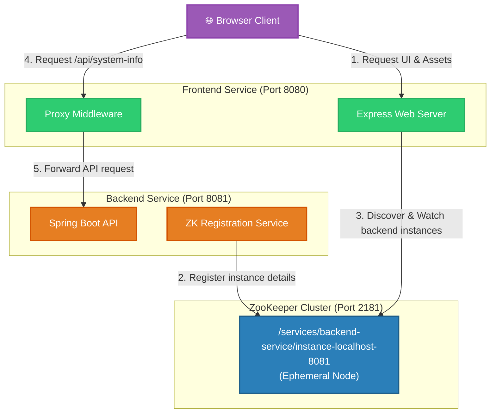
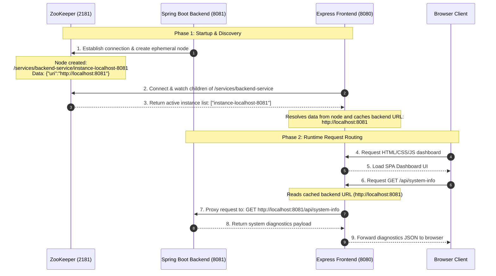

# ZooKeeper & Microservices Architecture Guide

This document explains the architecture of your newly migrated microservices system and how Apache ZooKeeper coordinates the communication between the services.

---

## 1. Architectural Components

Our system is split into three decoupled components, each with a distinct responsibility:

1. **ZooKeeper (`localhost:2181`)**: The **Service Registry & Coordinator**. It tracks which backend services are alive and where they are running.
2. **Java Spring Boot Service (`localhost:8081`)**: The **Backend REST API**. It performs the heavy lifting (telemetry, security, filesystem storage) and registers its presence in ZooKeeper.
3. **Node.js Express Service (`localhost:8080`)**: The **Frontend Server & API Gateway**. It serves the static dashboard files to the browser, reads backend addresses from ZooKeeper, and proxies API calls to the correct backend instance.

---

## 2. Component Diagram

The diagram below shows how the components interact. Notice that the browser never communicates with the backend directly; all API traffic is routed through the Frontend Server acting as a reverse proxy.

---

## 3. Detailed Sequence Flow

The interaction sequence consists of two distinct phases: **Startup** and **Runtime Request**.

---

## 4. Key ZooKeeper Concepts Used

### A. Service Registration (Ephemeral Nodes)
When the Spring Boot backend starts up, it registers itself by creating a **Znode** (ZooKeeper node) path. We use ZooKeeper's **Ephemeral** node mode. 
* **What is an Ephemeral Node?** Unlike persistent nodes, ephemeral nodes only exist as long as the client session that created them is active.
* **Why use it?** If the backend server crashes, gets killed, or experiences a network partition, its TCP session with ZooKeeper will expire. ZooKeeper will automatically delete the ephemeral node `/services/backend-service/instance-localhost-8081`. 

### B. Service Discovery (Watchers)
Our Node.js Express frontend server doesn't just read the backend address once. It places a **Watcher** (a listener event) on the parent folder `/services/backend-service`.
* **Dynamic Updates:** If ZooKeeper deletes the backend node (due to a backend crash), ZooKeeper fires a `NODE_CHILDREN_CHANGED` event to the Node.js watcher.
* **Immediate Failover:** The Node.js server immediately updates its internal `backendUrl` variable to `null`. Any incoming browser API requests are intercepted and returned as `503 Service Unavailable` instead of hanging or timing out.
* **Auto-recovery:** Once the backend restarts and re-registers, ZooKeeper alerts the Node.js server again, which resolves the backend URL, restoring normal routing seamlessly.
